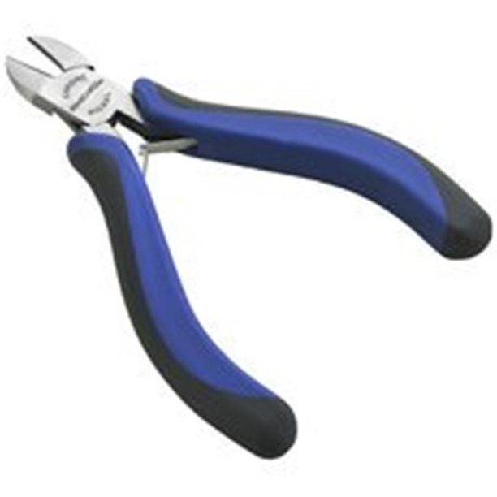
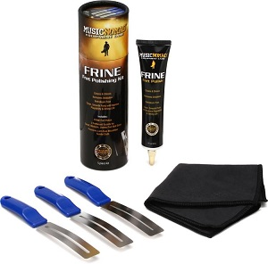
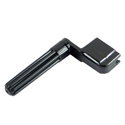

# How to change the strings on a guitar

Changing the strings on a guitar is vital for making a guitar sound as good as possible and keeping the intsrument in peak condition. This  process should be done when the strings of the guitar as corroded and there is dead skin and oil clearly hanging on the underside of the strings.

## Supplies needed

-Micro fiber clothes
-soft bristle brush (toothbrush)
-fretboard oil
-fret polishing kit
-guitar body polish
-fretboard cleaner
-New guitar strings
   > Strings come in many gauges. The gauge you choose is all personal preferance. Gauges are classified with a number. The smaller the number the thinner the strings will be and the larger the number the thicker the strings will be. The standard gauges are either 10 or 9 depending on the model of guitar.

## Steps

1. Loosen old strings and carefully remove them as fit.
    -many people use cross cut pliers after stirngs are loose
    -be carefull to not scratch the guitar if tools are used
    -throw old strings away immediately so they do not scratch the guitar
         > 

2. Apply fretboard cleaner to toothbrush and gently scrub the fretboard from one end to the other.
    -be sure to not apply fretboard cleaner directly to the guitar, this may damage it
    -this will remove sweat and oils from normal play
    
3. Use any fret polishing kit of your choice on each fret as needed.
    -make sure to only use a kit designed for guitars. This will keep the guitar safe
    -DO NOT USE POWER TOOLS
    -polished frets will make string bends eaiser
    -make sure to not overpolish. Only polish until tarnish is removed
         > 

4. Apply fretboard oil to the fretboard.
    -allow to sit for ten minutes then wipe off with microfiber cloth

5. Conservatively apply guitar body polish to microfiber cloth and wipe down the body and neck.

6. Wipe down any hardware using the same method in step 5.

7. Put new strings on guitar in the correct order. Bass strings are closer to the ceiling,
and treble strings are closer to the floor.
     > 

8. Tune your guitar. Some people choose to use a tuning winder when the strings are very loose.
     > 

9. Adjust the action by turning the screws on the bridge.
    - the action will be correct when there is no fret buzz
    - fret buzz is when the strings do not ring out since they touch the frets
    - Check all notes on the guitar for fret buzz

10. Retune the guitar.

